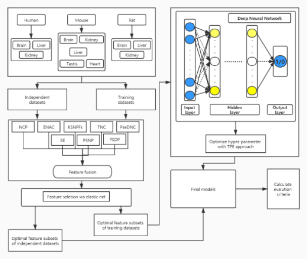

## DNN-m6A

A Cross-Species Method for Identifying RNA N6-methyladenosine Sites Based on Deep Neural Network with Multi-Information Fusion



### Requirements：

```python3
pip install pandas
pip install numpy (1.13.1)
pip install scipy
pip install h5py
pip install sys
pip install argparse
pip install pandas (0.20.1)
pip install matplotlib (2.1.0)
pip install sklearn (0.19.1)
pip install keras
pip install tensorflow
```
### Usage
To obtain the results of the DNN-m6A model on the example dataset, run the following code.
#### Step 1: Obtain the datasets.
The eleven datasets of different tissues from three species can be obtained from the following website: http://lin-group.cn/server.

#### Step 2: Feature extraction.
•	binary.py is the implementation of Binary.

•	ENAC.py is the implementation of ENAC.

•	NCP.py is the implementation of NCP.

•	PseDNC.py is the implementation of PseDNC.

•	TNC.py is the implementation of TNC.

•	PSNP.py is the implementation of PSNP.

•	PSDP.py is the implementation of PSDP.

#### Step 3: Feature selection.

•   EN.py represents the elastic net.

•  SE.py represents the spectral embedding.

•  SVD.py represents the singular value decomposition.

•  LLE.py represents the locally linear embedding.

•  mRMR.py represents the minimum redundancy maximum relevance.

For the initial feature vector sets, the feature selection methods can be used to eliminate redundant and irrelevant information, and retain the optimal feature vectors aiding to classification.

#### Step 4: Construct model.

The ` Classifier ` package stores the H5 files of the final 11 prediction models. 

